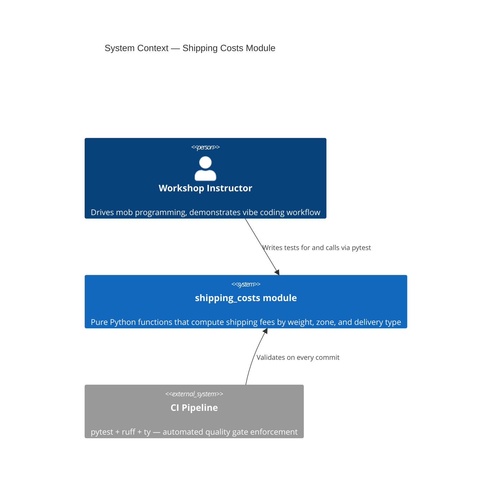
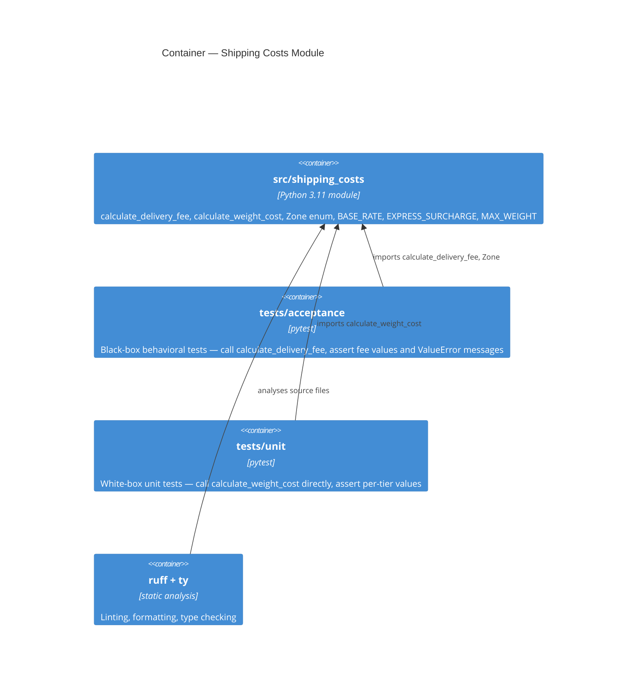

# Architecture Brief
**Project**: pycon-austria-2026-workshop
**Last updated**: 2026-04-17
**Paradigm**: Functional Python

---

## Application Architecture

**Architect**: Morgan (nw-solution-architect)
**Feature**: shipping-costs
**Pattern**: Pure-core module with separated test layers

### Quality Attribute Priorities

1. **Testability** — every function must be testable in isolation with no setup
2. **Readability** — workshop attendees read and modify this in 90 minutes
3. **Maintainability** — canonical function is unambiguous; teaching foil is clearly separated
4. **Simplicity** — no abstractions beyond what the domain requires

### Reuse Analysis

| Existing Component | File | Overlap | Decision | Justification |
|---|---|---|---|---|
| `calculate_delivery_fee` | `src/shipping_costs/__init__.py` | Canonical fee function | EXTEND (add tests) | Complete implementation; DESIGN adds coverage |
| `calculate_weight_cost` | `src/shipping_costs/__init__.py` | Weight tier helper | EXTEND (add unit tests) | Existing function is the isolated unit under test |
| `calculate_shipping_costs` | `src/shipping_costs/__init__.py` | Alternative implementation | NO ACTION | Intentional teaching foil per A5; not canonical |
| `Zone` enum | `src/shipping_costs/__init__.py` | Type-safe zone param | REUSE as-is | Correct and complete |

### Component Boundaries

```
src/shipping_costs/
  __init__.py          ← all domain logic (pure functions + enum + constants)
  main.py              ← CLI demo entry point (not under test)

tests/
  acceptance/
    test_shipping_costs.py   ← BLACK-BOX: tests calculate_delivery_fee only
                               Survives any internal refactor
                               Teaching artifact: these are the tests that stay GREEN
  unit/
    test_weight_calculation.py  ← WHITE-BOX: tests calculate_weight_cost in isolation
                                  Coupled to internal helper name
                                  Teaching artifact: these BREAK on refactor
```

**The split is the pedagogical point**: acceptance tests survive refactoring; unit tests do not.
The workshop attendee writes both, observes the difference when `calculate_shipping_costs` is
merged into `calculate_delivery_fee`.

### C4 System Context



### C4 Container



### Architecture Decision: Why No Ports-and-Adapters

The default nWave recommendation is ports-and-adapters (hexagonal). This feature does not apply it because:

- There are no I/O boundaries — the function is a pure computation with no side effects
- There are no external dependencies to invert
- Adding a port/adapter layer would be pure ceremony with no testability benefit — the function is already maximally testable as-is
- Workshop context: introducing hexagonal architecture would consume 30+ minutes of the 90-minute session on scaffolding, not on the TDD loop

Ports-and-adapters applies when there is a boundary to invert. A pure function **is** the port.

See: `adr-001-test-structure.md`, `adr-002-functional-paradigm.md`
